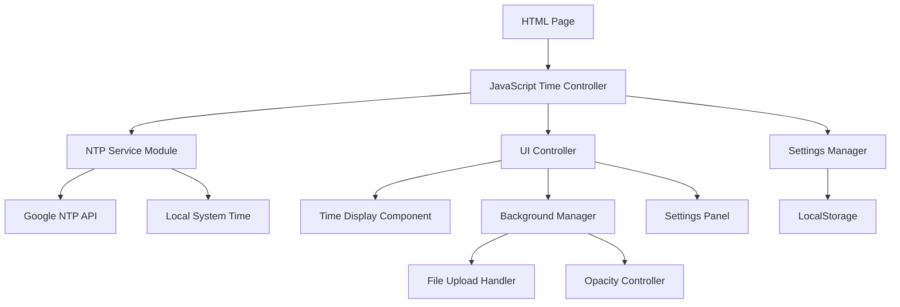

# Design Document

## Overview

The Time Display Webapp is a client-side web application that provides an accurate, customizable time display interface. The application fetches time from Google's NTP servers, displays it in a time.is-inspired interface, and allows users to customize the background with opacity controls. The entire application runs locally using HTML, CSS, and JavaScript without requiring a backend server.

## Architecture

### High-Level Architecture



### Technology Stack

- **Frontend**: HTML5, CSS3, Vanilla JavaScript (ES6+)
- **Storage**: Browser LocalStorage for user preferences
- **Time Source**: Google Public NTP (time.google.com) with fallback to local system time
- **Styling**: CSS Grid/Flexbox for responsive layout
- **File Handling**: HTML5 File API for background image uploads

## Components and Interfaces

### 1. Time Controller (Main Application Controller)

**Purpose**: Orchestrates time fetching, display updates, and coordinates between all modules.

**Key Methods**:
- `initialize()`: Sets up the application and starts time synchronization
- `updateTimeDisplay()`: Updates the UI with current time every second
- `syncWithNTP()`: Handles NTP synchronization with error handling
- `handleOfflineMode()`: Manages fallback to local time when NTP fails

**Interfaces**:
```javascript
class TimeController {
    constructor(ntpService, uiController, settingsManager)
    async initialize()
    startTimeUpdates()
    stopTimeUpdates()
    async syncWithNTP()
    handleOfflineMode()
}
```

### 2. NTP Service Module

**Purpose**: Handles communication with Google's NTP service and manages time synchronization.

**Key Methods**:
- `fetchNTPTime()`: Asynchronously fetches time from Google NTP
- `calculateOffset()`: Determines offset between local and NTP time
- `isOnline()`: Checks network connectivity status

**Interfaces**:
```javascript
class NTPService {
    constructor(ntpEndpoint = 'time.google.com')
    async fetchNTPTime()
    calculateOffset(ntpTime, localTime)
    isOnline()
    getAccurateTime()
}
```

**Note**: Since direct NTP protocol access isn't available in browsers, the implementation will use HTTP requests to time APIs or calculate time based on HTTP response headers from Google services.

### 3. UI Controller

**Purpose**: Manages all user interface interactions and visual updates.

**Key Methods**:
- `updateTimeDisplay(timeString)`: Updates the main time display
- `showConnectionStatus(isConnected)`: Shows NTP connection status
- `toggleSettingsPanel()`: Shows/hides customization options
- `updateBackgroundOpacity(value)`: Applies opacity changes in real-time

**Interfaces**:
```javascript
class UIController {
    constructor(settingsManager)
    updateTimeDisplay(timeString, showSeconds)
    showConnectionStatus(isConnected)
    toggleSettingsPanel()
    updateBackgroundOpacity(opacity)
    showErrorMessage(message)
}
```

### 4. Background Manager

**Purpose**: Handles background image upload, storage, and opacity management.

**Key Methods**:
- `uploadBackground(file)`: Processes and stores uploaded background images
- `setBackgroundOpacity(opacity)`: Adjusts background transparency
- `loadSavedBackground()`: Retrieves stored background on page load
- `resetToDefault()`: Restores default background

**Interfaces**:
```javascript
class BackgroundManager {
    constructor(settingsManager)
    async uploadBackground(file)
    setBackgroundOpacity(opacity)
    loadSavedBackground()
    resetToDefault()
    validateImageFile(file)
}
```

### 5. Settings Manager

**Purpose**: Manages user preferences and persistent storage using LocalStorage.

**Key Methods**:
- `saveSetting(key, value)`: Stores user preferences
- `getSetting(key, defaultValue)`: Retrieves stored preferences
- `loadAllSettings()`: Loads all saved settings on initialization

**Interfaces**:
```javascript
class SettingsManager {
    saveSetting(key, value)
    getSetting(key, defaultValue)
    loadAllSettings()
    clearAllSettings()
}
```

### 6. World Clock Manager

**Purpose**: Manages multiple time zone displays and world clock functionality.

**Key Methods**:
- `addWorldClock(timezone, cityName)`: Adds a new world clock
- `removeWorldClock(id)`: Removes a world clock
- `updateAllWorldClocks()`: Updates time for all enabled world clocks
- `getAvailableTimezones()`: Returns list of selectable time zones

**Interfaces**:
```javascript
class WorldClockManager {
    constructor(settingsManager)
    addWorldClock(timezone, cityName)
    removeWorldClock(id)
    updateAllWorldClocks()
    getAvailableTimezones()
    getTimeForTimezone(timezone)
    formatDateForTimezone(date, timezone)
}
```

## Data Models

### Time Data Structure
```javascript
const TimeData = {
    hours: Number,        // 0-23 or 1-12 depending on format
    minutes: Number,      // 0-59
    seconds: Number,      // 0-59
    ampm: String,        // 'AM' or 'PM' (if 12-hour format)
    timezone: String,     // User's local timezone
    isNTPSynced: Boolean, // Whether time is from NTP or local
    lastSync: Date,      // Last successful NTP sync timestamp
    date: {
        dayName: String,     // 'Tuesday'
        day: Number,         // 14
        monthName: String,   // 'October'
        year: Number,        // 2025
        weekNumber: Number   // 42
    }
}
```

### World Clock Data Structure
```javascript
const WorldClockData = {
    id: String,              // Unique identifier
    cityName: String,        // 'New York', 'London', 'Tokyo'
    timezone: String,        // 'America/New_York', 'Europe/London'
    timeData: TimeData,      // Time data for this timezone
    isEnabled: Boolean       // Whether this world clock is active
}
```

### User Settings Structure
```javascript
const UserSettings = {
    showSeconds: Boolean,           // Show/hide seconds in display
    use24HourFormat: Boolean,       // 12-hour vs 24-hour format
    backgroundOpacity: Number,      // 0.0 to 1.0
    backgroundImage: String,        // Base64 encoded image or null
    ntpSyncInterval: Number,        // Minutes between NTP syncs
    theme: String,                  // 'light' or 'dark'
    worldClocks: Array,             // Array of selected world clock configurations
    showDate: Boolean,              // Show/hide date display
    showWorldClocks: Boolean        // Show/hide world clocks section
}
```

## Error Handling

### NTP Connection Failures
- **Graceful Fallback**: Automatically switch to local system time
- **User Notification**: Display subtle indicator showing offline mode
- **Retry Logic**: Attempt reconnection every 5 minutes
- **Error Logging**: Log connection issues for debugging

### File Upload Errors
- **File Validation**: Check file type, size, and format before processing
- **Error Messages**: Show clear, user-friendly error messages
- **Fallback Behavior**: Maintain current background if upload fails
- **Memory Management**: Properly dispose of failed file objects

### Browser Compatibility
- **Feature Detection**: Check for required APIs before using them
- **Polyfills**: Include necessary polyfills for older browsers
- **Progressive Enhancement**: Core functionality works without advanced features

## Testing Strategy

### Unit Testing Approach
- **Time Calculations**: Test NTP offset calculations and time formatting
- **Settings Management**: Verify LocalStorage operations and data persistence
- **Background Processing**: Test image upload and opacity calculations
- **Error Scenarios**: Test all failure modes and fallback behaviors

### Integration Testing
- **NTP Integration**: Test actual NTP service communication
- **UI Interactions**: Test user interface responsiveness and updates
- **Cross-browser Testing**: Verify functionality across major browsers
- **Performance Testing**: Ensure smooth 1-second time updates

### Manual Testing Scenarios
- **Offline Mode**: Test behavior when internet connection is lost
- **Large Images**: Test background upload with various image sizes
- **Settings Persistence**: Verify settings survive browser restart
- **Responsive Design**: Test on different screen sizes and orientations

## Performance Considerations

### Optimization Strategies
- **Efficient DOM Updates**: Minimize DOM manipulation during time updates
- **Image Optimization**: Compress uploaded backgrounds for better performance
- **Memory Management**: Properly clean up intervals and event listeners
- **Lazy Loading**: Load settings panel components only when needed

### Resource Management
- **NTP Sync Frequency**: Balance accuracy with network usage (default: 15 minutes)
- **Image Storage**: Limit background image size to prevent LocalStorage overflow
- **Timer Precision**: Use requestAnimationFrame for smooth visual updates
- **Event Debouncing**: Debounce opacity slider changes to prevent excessive updates

## Security Considerations

### Data Privacy
- **Local Storage Only**: All user data stays in browser LocalStorage
- **No External Tracking**: No analytics or tracking services
- **Secure Connections**: Use HTTPS for all external time service requests

### Input Validation
- **File Type Validation**: Strictly validate uploaded image file types
- **Size Limits**: Enforce reasonable file size limits for backgrounds
- **XSS Prevention**: Sanitize any user inputs and file names
- **CSP Headers**: Implement Content Security Policy for additional protection